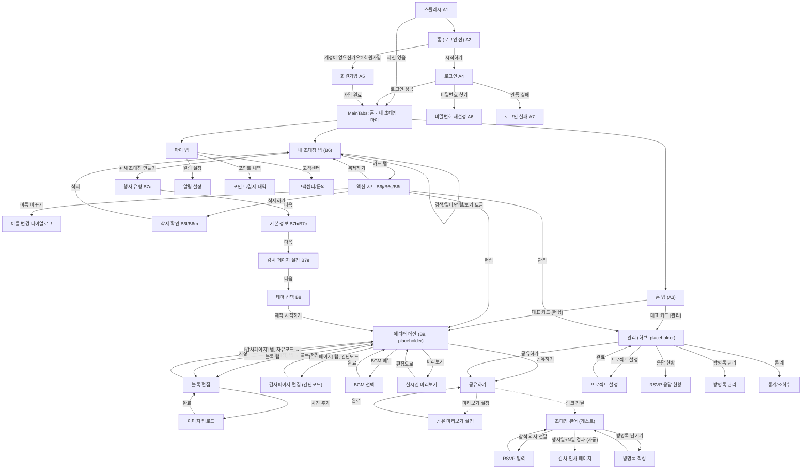

# 앱 화면 구성 (정보구조 / IA)

> `PLANNING.md`에서 논의된 기능을 바탕으로 필요한 화면을 카테고리별로 정리한 문서입니다.
> 결혼식에 국한하지 않고 모든 행사(결혼식·돌잔치·생일파티·집들이 등)의 초대장을 다루므로, 화면/용어도 "초대장"·"행사"·"게스트" 기준으로 일반화했습니다. 행사 유형별로 화면이 갈라지지는 않으며, 프로젝트 생성 시 행사 유형을 선택하고 문구는 사용자가 자유롭게 채웁니다.
>
> 디자인 핸드오프가 들어온 화면은 코드(React Native/Expo, `mobile/`)로 구현을 마쳤고 상태를 **✅ 구현됨**으로 표시합니다. 나머지는 아직 디자인 전이라 기능 명세만 있거나(B6 상세 스펙처럼) 자리만 잡아둔 상태입니다.

## A. 앱 공통 / 기본 구성 — ✅ 구현됨 (A1–A7)

| # | 코드 | 화면 | 설명 |
|---|---|---|---|
| 1 | A1 | 스플래시(로딩) 화면 | 앱 실행 시 첫 진입, 1.2초 후 로그인 여부에 따라 A3 또는 A2로 자동 전환 |
| 2 | A2 | 홈 화면 (로그인 전) | 서비스 소개 + 블록 미리보기, `시작하기`(→ 로그인) / `계정이 없으신가요? 회원가입`(→ 회원가입) |
| 3 | A3 | 홈 화면 (로그인 후) | 대표 프로젝트 카드(편집/관리) + 알림 행. 이제 하단 탭(`MainTabs`)의 "홈" 탭으로 진입 |
| 4 | A4 | 로그인 화면 | |
| 5 | A7 | 로그인 실패 화면 | A4에서 인증 실패 시 상태 |
| 6 | A5 | 회원가입 화면 | |
| 7 | A6 | 비밀번호 찾기/재설정 화면 (2단계) | |

## B. 제작 흐름 (로그인 후 — 프로젝트/에디터)

**진입 순서 확정**: 프로젝트 생성(B7) → 스타일 테마 선택(B8) → 에디터 메인(B9)

**탐색 구조**: 로그인 후에는 실제 하단 탭 내비게이션(`MainTabs`: 홈 · 내 초대장 · 마이)으로 진입합니다. 이전에는 화면마다 탭바를 흉내 낸 가짜 UI였으나, `@react-navigation/bottom-tabs` 기반의 진짜 탭 네비게이터로 교체했습니다.

**프로젝트 목록 카드 구조**: 각 초대장 카드에 **[편집] [관리]** 2개 버튼이 함께 노출됨 — 에디터는 순수 콘텐츠 편집 전용, 관리는 응답/방명록/통계/프로젝트 설정 전용으로 역할 분리.

**에디터 내부는 편집 대상에 따라 2가지로 나뉨**:
- **초대장 편집**: 기존 블록 에디터로 편집
- **감사페이지 편집**: 관리 화면에서 설정한 감사페이지 모드에 따라 분기
  - 자유 모드 → 초대장과 **동일한 블록 에디터 재사용** (편집 대상만 감사페이지로 전환)
  - 간단 모드 → 고정 레이아웃의 **별도 라이트 편집 화면** (문구+사진 정도만 교체)

| # | 코드 | 화면 | 상태 | 설명 |
|---|---|---|---|---|
| 8 | B6 | 프로젝트 목록 화면 | ✅ 구현됨 | 내가 만든 초대장들 목록, 검색·필터·정렬·보기 3종 지원. 카드마다 [편집]/[관리] |
| 9 | B7 | 프로젝트 생성 화면 (4단계 중 1–3) | ✅ 구현됨 | 행사 유형 → 기본 정보(호스트/일시/장소) → 감사 페이지 설정 |
| 10 | B8 | 스타일 테마 선택 화면 (4단계 중 4) | ✅ 구현됨 | 색상/폰트 기본 테마 6종 중 선택, `제작 시작하기` → B9 |
| 11 | B9 | 에디터 메인 화면 | 자리만 있음(placeholder) | [초대장]/[감사페이지] 탭 전환 + 블록 목록 추가·삭제·순서 변경 — 디자인 전이라 `EditorPlaceholderScreen`으로 임시 연결 |
| 12 | — | 블록 편집 화면 | 미착수 | 선택한 블록의 텍스트/이미지/색상/폰트/배열모드(세로·가로) 설정 (초대장·감사페이지 자유모드 공용) |
| 13 | — | 이미지 업로드/편집 화면 | 미착수 | 사진 첨부, 크롭 |
| 14 | — | BGM 선택 화면 | 미착수 | 배경음악 설정 |
| 15 | — | 실시간 미리보기 화면 | 미착수 | 에디터에서 결과물을 모바일 뷰로 확인 |
| 16 | — | 감사페이지 편집 화면 (간단 모드) | 미착수 | 고정 레이아웃 — 감사 문구 + 대표 사진 교체 전용 |

### B6 프로젝트 목록 화면 상세 — 검색 · 필터 · 정렬 · 보기 방식

디자인 핸드오프(`docs/design/B-project/README.md`, 스크린샷 코드 B6b–B6t)를 그대로 구현했습니다. 아래는 확정된 동작 명세입니다.

#### 1. 검색 (B6e)
- 대상: 프로젝트명(초대장 제목), 부분 일치
- 입력하는 대로 실시간으로 목록이 좁혀짐, 별도 검색 버튼 없음
- 검색어가 비어 있으면 전체 목록 노출

#### 2. 필터 (B6f)
- **초대장 상태**: 전체 · 작성중 · 공유중 · 감사 페이지 · 지난 행사 (전체는 단독 선택, 나머지는 다중 선택 가능 — 하나라도 고르면 전체는 해제)
- **행사 월**: 연도 이동 가능, 1~12월 중 다중 선택
- **행사 종류**: 8개 카테고리(결혼식·돌잔치·백일·생일파티·집들이·개업식·동창회·기타) 다중 선택
- **장소 지역(시도)**: 17개 광역시도, 다중 선택
- 카테고리 내부는 OR, 카테고리 간에는 AND로 결합 — **확정**
- 적용된 필터 개수를 [필터] 버튼에 뱃지로 표시, 하단 고정 바에 [초기화] + [결과 N개 보기]
- UI는 화면 3/4 높이의 바텀시트

#### 3. 정렬 (B6g, 단일 선택)
- **최근 수정순 — 기본값(확정)**: 방금 작업하던 프로젝트가 맨 위로 오는 "이어서 작업하기" 시나리오
- **최근 행사순**: 행사일이 늦은(가까운 미래부터 먼 미래까지, 내림차순이 아니라 **최신 날짜가 먼저 오는 순서**) 순서 — ⚠️ 이전 버전 문서에 "행사일이 가까운 순"이라고 잘못 적혀 있었음. 디자인 핸드오프 기준 정확한 정의는 **행사일 내림차순(날짜가 늦은 것부터)** 이다.
- **오래된 행사순**: 행사일 오름차순(날짜가 빠른 것부터)
- **최근 만든순**: 생성일(createdAt) 내림차순
- **이름순**: 가나다 · ABC
- 한 번에 하나만 선택, 고르면 바로 시트가 닫힘

#### 4. 보기 방식 (3종, 토글)
프로젝트 카드마다 [편집]/[관리] 진입은 모든 보기 방식에서 "카드 탭 → 액션 시트"로 통일됩니다(개별 버튼 아님). 마지막으로 선택한 보기 방식은 기기에 저장되어 기억됩니다.

| 방식 | 코드 | 노출 정보 |
|---|---|---|
| 자세한 카드형 (기본값, 확정) | B6p | 썸네일 + 상태칩 + 행사 종류 + D-day + 제목 + 일시/장소 + RSVP·방명록 수(또는 수정 시점) + 감사 페이지 안내 띠 |
| 썸네일 카드형 | B6q | 2열 그리드, 썸네일 + 상태칩 + (설정 시) 감사 페이지 완료 보조칩 + 제목 한 줄 |
| 리스트형 | B6r | 제목 + 유형·일시/장소 + 안내 한 줄(텍스트 중심), 상태칩 + D-day |

#### 5. 카드 탭 → 액션 시트 (B6j / B6s / B6t)
- 상단: 상태칩 · 유형 · D-day · 제목
- 2분할 큰 버튼: **[편집]**(→ B9) / **[관리]**(→ E21)
- **감사 페이지 설정 박스**: 설정됨(B6s, 기간 표시 + [기간 변경]/[감사 페이지 편집]) / 미설정(B6t, 안내 문구 + [기간 설정]/[감사 페이지 편집])
- 메뉴: 미리보기 · 공유 링크 복사 · 이름 바꾸기 · 복제하기
- 구분선 뒤 **삭제하기**(→ 삭제 다이얼로그)
- 감사 페이지 설정 박스 노출 조건은 작성중/공유중 상태로 구현(감사 페이지·지난 행사 전환 후에는 상태칩만 남고 설정 박스는 숨김) — 핸드오프 스크린샷상 공유중 카드에서의 노출 여부가 모호했던 지점이라, 문서(README) 스펙인 "항상 노출"이 아니라 보수적으로 이 조건으로 구현함을 기록해둠.

#### 6. 삭제 (B6l / B6m / B6n / B6o)
- **작성중(공유 전)**: 단순 확인 다이얼로그(`'{title}'을 삭제할까요?`)
- **공유중 이상**: 경고 문구 + 정보 박스(초대장 이름/공유 링크/RSVP·방명록 삭제 건수) + "응답 데이터 먼저 내려받기" 링크(CSV, 현재는 스텁) + 체크박스로 확인해야 [삭제하기] 활성화
- 완료 시 토스트 노출(`'{title}'을 삭제했어요`, 3초), 휴지통/되돌리기 없음 — 즉시 영구 삭제(확정)

#### 조합 동작 / 데이터 모델
- 검색 → 필터 → 정렬 순으로 적용 (동시 사용 가능)
- 결과가 0건이면 B6i 빈 상태(`조건에 맞는 초대장이 없어요`) + [필터 초기화]
- 데이터 모델은 `mobile/src/types/project.ts`에 구현: `Project { id, title, eventType, customTypeName?, hosts, eventAt, venue?, thanks:{enabled, days?, hasContent}, shared, themeId, updatedAt, createdAt, counts:{rsvp, guestbook} }`
- 상태 파생 규칙(`mobile/src/utils/projectStatus.ts`에 구현, 확정):
  1. `!shared` → 작성중
  2. `shared && now < thanksStart` → 공유중 (`thanksStart` = 행사 다음 날 00:00)
  3. `thanks.enabled && thanksStart ≤ now ≤ thanksEnd` → 감사 페이지 (`thanksEnd` = `thanksStart + days - 1`, 23:59:59)
  4. 그 외 → 지난 행사 (감사 페이지 미설정이면 행사 다음 날부터 링크 접속 불가)

### B7 · B8 프로젝트 생성 (4단계) — ✅ 구현됨

공통: 헤더 `← 새 초대장`, 진행 바(25/50/75/100%), 단계 라벨 `n / 4`, 하단 진행 버튼 `다음`(마지막 단계만 `제작 시작하기`).

| 단계 | 코드 | 화면 | 내용 |
|---|---|---|---|
| 1/4 | B7a / B7d | 행사 유형 (`NewProjectTypeScreen`) | 8개 타일 2열 선택. "기타" 선택 시 행사 이름 직접 입력 필드 노출 |
| 2/4 | B7b / B7c | 기본 정보 (`NewProjectInfoScreen`) | 유형별 호스트 라벨(신랑·신부 / 아이·부모님 / 주인공 등) 2칸, 행사 일시(네이티브 날짜·시간 피커), 행사 장소(텍스트 입력 + 시도 칩 선택 + 네이버 지도·카카오맵 연결 토글 2개, 독립 선택) |
| 3/4 | B7e | 감사 페이지 설정 (`NewProjectThanksScreen`) | 설정/미설정 토글, 설정 시 1~7일 기간 선택 + 기간 미리보기(행사일 기준 자동 계산) |
| 4/4 | B8 | 테마 선택 (`ThemeSelectScreen`) | 6종 테마(리넨·라벤더·블러쉬·가든·세이지·잉크) 2열 카드, `제작 시작하기` → B9(현재는 placeholder) |

- **[단순화]** 행사 장소는 실제 장소검색 API 대신 텍스트 입력 + 시도 칩 수동 선택으로 구현(연동 가능한 지도/장소 API가 아직 없음). 지도·길찾기 연결 토글 UI는 실제로 구현했으나 딥링크 연동은 하지 않음.
- 생성 중인 입력값은 `NewProjectDraftContext`(인메모리)에서 관리.

## C. 공유 관련 화면

공유하기는 **에디터와 관리 양쪽 모두에서 진입 가능**합니다.

| # | 화면 | 설명 |
|---|---|---|
| 17 | 공유하기 화면 | 링크 복사, 카카오톡 공유 |
| 18 | 공유 미리보기 설정 화면 | 카카오톡 공유 시 노출되는 OG 타이틀/이미지 커스터마이징 |

## D. 게스트가 보는 화면 (결과물 — 웹, 앱 설치 불필요)

| # | 화면 | 설명 |
|---|---|---|
| 19 | 초대장 뷰어 화면 | 최종 결과물 (행사일까지) |
| 20 | RSVP 응답 입력 화면 | 참석 여부/식사 여부/동반 인원 응답 |
| 21 | 방명록 작성 화면 | 게스트가 축하 메시지 남기기 |
| 22 | 감사 인사 페이지 | 행사일+N일 이후 자동 전환된 화면 (동일 URL) |

## E. 결과 데이터 확인/관리 화면 (제작자용)

프로젝트 목록에서 **[관리]** 버튼을 누르면 진입하는 영역. RSVP·방명록·통계·공유하기·프로젝트 설정으로 연결되는 허브 화면입니다. 현재는 `ManagePlaceholderScreen`으로 임시 연결되어 있습니다(디자인 전).

**감사페이지 모드 전환 시 데이터 처리 확정**: 자유 모드 ↔ 간단 모드는 레이아웃 틀 자체가 달라서 기존 블록 콘텐츠를 그대로 옮길 수 없음 → **자유 → 간단 전환 시 기존 블록 콘텐츠는 삭제**. 단, 전환 즉시 삭제하지 않고 **"모드를 전환하면 기존 작업 내용이 초기화됩니다. 계속하시겠습니까?" 확인 모달**을 띄워 사용자가 최종 결정.

| # | 화면 | 설명 |
|---|---|---|
| 21 | 관리 화면 (허브) | RSVP 응답현황·방명록관리·통계·공유하기·프로젝트 설정으로 연결되는 진입 화면 |
| 22 | 프로젝트 설정 화면 | 감사 페이지 전환일(1~7일), 감사페이지 모드(간단/자유) 선택 등 전역 옵션 — 모드를 자유→간단으로 바꾸면 확인 모달 노출 |
| 23 | RSVP 응답 현황 화면 | 참석자 목록/통계 |
| 24 | 방명록 관리 화면 | 제작자가 확인·삭제 |
| 25 | 통계/조회수 화면 | 초대장 조회수 등 부가 지표 |

## F. 계정 / 설정

| # | 화면 | 설명 |
|---|---|---|
| 26 | 마이페이지 화면 | 계정 정보 관리. `MainTabs`의 "마이" 탭에서 진입(현재 `MyPlaceholderScreen`) |
| 27 | 알림 설정 화면 | RSVP 응답·방명록 알림 등 푸시 설정 |
| 28 | 포인트/결제 내역 화면 | 2차 기능 (포인트 결제 시스템 도입 이후) |
| 29 | 고객센터/문의 화면 | |

## G. 공통 상태 화면

| # | 화면 | 설명 |
|---|---|---|
| 30 | 에러/네트워크 오류 화면 | |
| 31 | 빈 상태(Empty state) 화면 | 프로젝트 없음 등(B6b로 구현됨) |

## 화면 흐름 다이어그램

디자인이 아니라 "어떤 동작을 하면 어떤 화면으로 이동하는지"만 표현한 흐름도입니다. 점선(`-.->`)은 자동 전환/링크 전달처럼 사용자의 직접 탭이 아닌 흐름입니다. 에러/빈 상태 화면(G)은 특정 상황에서 조건부로 뜨는 공통 화면이라 흐름도에는 표시하지 않았습니다.

## 다음 논의 필요

- [ ] 확인 모달의 정확한 문구, 그리고 삭제 전 "되돌릴 수 없음"을 얼마나 강하게 경고할지 (예: 프로젝트 설정 화면 UX 세부사항) — B6 삭제 플로우는 확정, E22 프로젝트 설정의 모드 전환 모달은 아직 미착수
- [x] 필터 카테고리 내부 다중 선택 허용 여부 — 다중 선택 확정 (디자인 핸드오프 기준)
- [x] 목록 기본 정렬 기준 — 최근 수정순 확정
- [x] 보기 방식 기본값 — 자세한 카드형 확정
- [ ] B6j 액션 시트의 감사 페이지 설정 박스가 "공유중" 상태에서도 항상 보여야 하는지, 전환 후(감사 페이지/지난 행사)에도 보여야 하는지 — 현재는 작성중/공유중에서만 노출로 구현, 핸드오프 스크린샷상 모호했던 지점이라 추가 확인 필요
