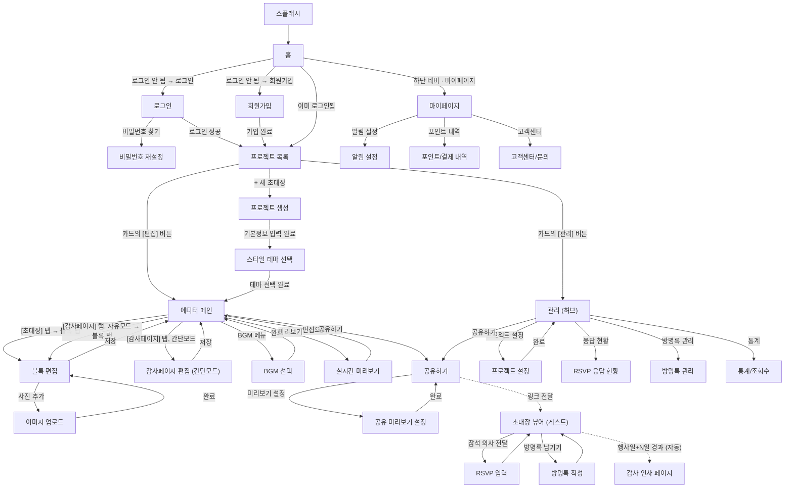

# 앱 화면 구성 (정보구조 / IA)

> `PLANNING.md`에서 논의된 기능을 바탕으로 필요한 화면을 카테고리별로 정리한 문서입니다.
> 결혼식에 국한하지 않고 모든 행사(결혼식·돌잔치·생일파티·집들이 등)의 초대장을 다루므로, 화면/용어도 "초대장"·"행사"·"게스트" 기준으로 일반화했습니다. 행사 유형별로 화면이 갈라지지는 않으며, 프로젝트 생성 시 행사 유형을 선택하고 문구는 사용자가 자유롭게 채웁니다.

## A. 앱 공통 / 기본 구성

| # | 화면 | 설명 |
|---|---|---|
| 1 | 스플래시(로딩) 화면 | 앱 실행 시 첫 진입 |
| 2 | 홈 화면 | 로그인 전: 서비스 소개+로그인 유도 / 로그인 후: 내 프로젝트로 연결 |
| 3 | 로그인 화면 | |
| 4 | 회원가입 화면 | |
| 5 | 비밀번호 찾기/재설정 화면 | |

## B. 제작 흐름 (로그인 후 — 프로젝트/에디터)

**진입 순서 확정**: 프로젝트 생성 → 스타일 테마 선택 → 에디터 메인

**프로젝트 목록 카드 구조**: 각 초대장 카드에 **[편집] [관리]** 2개 버튼이 함께 노출됨 — 에디터는 순수 콘텐츠 편집 전용, 관리는 응답/방명록/통계/프로젝트 설정 전용으로 역할 분리.

**에디터 내부는 편집 대상에 따라 2가지로 나뉨**:
- **초대장 편집**: 기존 블록 에디터로 편집
- **감사페이지 편집**: 관리 화면에서 설정한 감사페이지 모드에 따라 분기
  - 자유 모드 → 초대장과 **동일한 블록 에디터 재사용** (편집 대상만 감사페이지로 전환)
  - 간단 모드 → 고정 레이아웃의 **별도 라이트 편집 화면** (문구+사진 정도만 교체)

| # | 화면 | 설명 |
|---|---|---|
| 6 | 프로젝트 목록 화면 | 내가 만든 초대장들 목록, 검색·필터·정렬·보기 방식 지원. 카드마다 [편집]/[관리] 버튼 |
| 7 | 프로젝트 생성 화면 | 행사 유형 선택(결혼식·돌잔치·백일·생일파티·집들이·개업식·동창회·기타(직접입력)), 호스트 정보, 행사 일시/장소 등 기본 정보 입력 |
| 8 | 스타일 테마 선택 화면 | 색상/폰트 기본 테마를 초기에 고르는 단계 |
| 9 | 에디터 메인 화면 | [초대장]/[감사페이지] 탭 전환 + 블록 목록 추가·삭제·순서 변경 |
| 10 | 블록 편집 화면 | 선택한 블록의 텍스트/이미지/색상/폰트/배열모드(세로·가로) 설정 (초대장·감사페이지 자유모드 공용) |
| 11 | 이미지 업로드/편집 화면 | 사진 첨부, 크롭 |
| 12 | BGM 선택 화면 | 배경음악 설정 |
| 13 | 실시간 미리보기 화면 | 에디터에서 결과물을 모바일 뷰로 확인 |
| 14 | 감사페이지 편집 화면 (간단 모드) | 고정 레이아웃 — 감사 문구 + 대표 사진 교체 전용 |

### 프로젝트 목록 화면 상세 — 검색 · 필터 · 정렬 · 보기 방식

디자인은 별도 작업 예정이라 여기서는 기능/동작 명세만 정리합니다.

#### 1. 검색
- 대상: 프로젝트명(초대장 제목)
- 입력하는 대로 실시간으로 목록이 좁혀짐 (디바운스 권장, 별도 검색 버튼 없음)
- 검색어가 비어 있으면 전체 목록 노출

#### 2. 필터
- **행사 월**: 1~12월 중 선택
- **행사 종류**: 프로젝트 생성 시 확정한 8개 카테고리와 동일 — 결혼식·돌잔치·백일·생일파티·집들이·개업식·동창회·기타
- **장소 지역(시도)**: 17개 광역시도 기준
- **[가정] 각 카테고리 내부는 다중 선택 가능** (예: 지역에서 "서울"과 "경기"를 동시에 체크) — 카테고리 내부는 OR, 카테고리 간에는 AND로 결합. 단일 선택만 필요하면 말씀해주세요.
- 적용된 필터 개수를 필터 버튼에 뱃지로 표시, 전체 해제 버튼 필요
- UI는 모바일 환경을 고려해 바텀시트 형태를 권장 (디자인 단계에서 확정)

#### 3. 정렬
- 최근 수정순 — **[가정] 기본값**: 방금 작업하던 프로젝트가 맨 위로 오는 게 "이어서 작업하기" 시나리오에 가장 자연스러워서 기본값으로 제안. 다른 기준을 기본값으로 원하시면 말씀해주세요.
- 최근 행사순 (행사일이 가까운 순)
- 오래된 행사순 (행사일이 먼 순)
- [제안] 이름순(가나다) — 필요 없으면 제외
- 한 번에 하나만 선택 가능 (정렬은 다중 선택 대상이 아님)

#### 4. 보기 방식
프로젝트 카드마다 [편집]/[관리] 버튼이 붙는 기본 구조는 3가지 보기 방식 모두에서 동일하게 유지됩니다. 3가지 중 하나를 토글로 전환하며, 마지막으로 선택한 방식을 기억합니다.

| 방식 | 노출 정보 |
|---|---|
| 자세한 그리드형 | 썸네일 + 행사 종류 + 행사일 + 장소 |
| 썸네일 카드형 | 썸네일 + 행사명 |
| 리스트형 | 행사명 + 행사일 + 장소 (텍스트 중심) |

- **[가정] 기본값은 "자세한 그리드형"** — 정보량이 가장 많아서 처음 쓰는 사용자에게 안내가 더 잘 될 것 같아 제안. 다른 걸 기본값으로 원하시면 말씀해주세요.

#### 조합 동작 / 데이터 요구사항
- 검색 → 필터 → 정렬 순으로 적용 (동시 사용 가능)
- 결과가 0건이면 빈 상태 문구 + "필터 초기화" 버튼 노출
- 위 기능이 동작하려면 프로젝트마다 다음 필드가 필요: 제목(프로젝트명), 행사 종류, 행사 일시, 지역(시도), 장소명, 최근 수정 일시, 썸네일, 상태(제작중/공유중/감사페이지)

## C. 공유 관련 화면

공유하기는 **에디터와 관리 양쪽 모두에서 진입 가능**합니다.

| # | 화면 | 설명 |
|---|---|---|
| 15 | 공유하기 화면 | 링크 복사, 카카오톡 공유 |
| 16 | 공유 미리보기 설정 화면 | 카카오톡 공유 시 노출되는 OG 타이틀/이미지 커스터마이징 |

## D. 게스트가 보는 화면 (결과물 — 웹, 앱 설치 불필요)

| # | 화면 | 설명 |
|---|---|---|
| 17 | 초대장 뷰어 화면 | 최종 결과물 (행사일까지) |
| 18 | RSVP 응답 입력 화면 | 참석 여부/식사 여부/동반 인원 응답 |
| 19 | 방명록 작성 화면 | 게스트가 축하 메시지 남기기 |
| 20 | 감사 인사 페이지 | 행사일+N일 이후 자동 전환된 화면 (동일 URL) |

## E. 결과 데이터 확인/관리 화면 (제작자용)

프로젝트 목록에서 **[관리]** 버튼을 누르면 진입하는 영역. RSVP·방명록·통계·공유하기·프로젝트 설정으로 연결되는 허브 화면입니다.

**감사페이지 모드 전환 시 데이터 처리 확정**: 자유 모드 ↔ 간단 모드는 레이아웃 틀 자체가 달라서 기존 블록 콘텐츠를 그대로 옮길 수 없음 → **자유 → 간단 전환 시 기존 블록 콘텐츠는 삭제**. 단, 전환 즉시 삭제하지 않고 **"모드를 전환하면 기존 작업 내용이 초기화됩니다. 계속하시겠습니까?" 확인 모달**을 띄워 사용자가 최종 결정.

| # | 화면 | 설명 |
|---|---|---|
| 21 | 관리 화면 (허브) | RSVP 응답현황·방명록관리·통계·공유하기·프로젝트 설정으로 연결되는 진입 화면 |
| 22 | 프로젝트 설정 화면 | 감사 페이지 전환일(1~7일), 감사페이지 모드(간단/자유) 선택 등 전역 옵션 — 모드를 자유→간단으로 바꾸면 확인 모달 노출 |
| 23 | RSVP 응답 현황 화면 | 참석자 목록/통계 |
| 24 | 방명록 관리 화면 | 제작자가 확인·삭제 |
| 25 | 통계/조회수 화면 | 초대장 조회수 등 부가 지표 |

## F. 계정 / 설정

| # | 화면 | 설명 |
|---|---|---|
| 26 | 마이페이지 화면 | 계정 정보 관리 |
| 27 | 알림 설정 화면 | RSVP 응답·방명록 알림 등 푸시 설정 |
| 28 | 포인트/결제 내역 화면 | 2차 기능 (포인트 결제 시스템 도입 이후) |
| 29 | 고객센터/문의 화면 | |

## G. 공통 상태 화면

| # | 화면 | 설명 |
|---|---|---|
| 30 | 에러/네트워크 오류 화면 | |
| 31 | 빈 상태(Empty state) 화면 | 프로젝트 없음 등 |

## 화면 흐름 다이어그램

디자인이 아니라 "어떤 동작을 하면 어떤 화면으로 이동하는지"만 표현한 흐름도입니다. 점선(`-.->`)은 자동 전환/링크 전달처럼 사용자의 직접 탭이 아닌 흐름입니다. 에러/빈 상태 화면(G)은 특정 상황에서 조건부로 뜨는 공통 화면이라 흐름도에는 표시하지 않았습니다.

## 다음 논의 필요

- [ ] 확인 모달의 정확한 문구, 그리고 삭제 전 "되돌릴 수 없음"을 얼마나 강하게 경고할지 (예: 프로젝트 설정 화면 UX 세부사항)
- [ ] 필터 카테고리 내부 다중 선택 허용 여부 확정 (현재 다중 선택으로 가정)
- [ ] 목록 기본 정렬 기준 확정 (현재 최근 수정순으로 가정)
- [ ] 보기 방식 기본값 확정 (현재 자세한 그리드형으로 가정)
