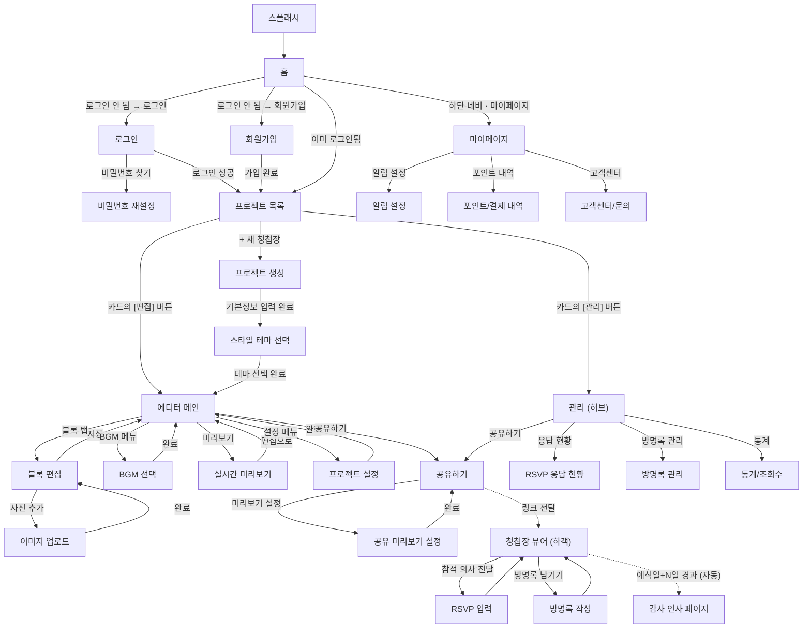

# 앱 화면 구성 (정보구조 / IA)

> `PLANNING.md`에서 논의된 기능을 바탕으로 필요한 화면을 카테고리별로 정리한 문서입니다.

## A. 앱 공통 / 기본 구성

| # | 화면 | 설명 |
|---|---|---|
| 1 | 스플래시(로딩) 화면 | 앱 실행 시 첫 진입 |
| 2 | 홈 화면 | 로그인 전: 서비스 소개+로그인 유도 / 로그인 후: 내 프로젝트로 연결 |
| 3 | 로그인 화면 | |
| 4 | 회원가입 화면 | |
| 5 | 비밀번호 찾기/재설정 화면 | |

## B. 제작 흐름 (로그인 후 — 프로젝트/에디터)

**진입 순서 확정**: 프로젝트 생성 → 스타일 테마 선택 → 에디터 메인

**프로젝트 목록 카드 구조**: 각 청첩장 카드에 **[편집] [관리]** 2개 버튼이 함께 노출됨 — 에디터는 순수 콘텐츠 편집 전용, 관리는 응답/방명록/통계 확인 전용으로 역할 분리.

| # | 화면 | 설명 |
|---|---|---|
| 6 | 프로젝트 목록 화면 | 내가 만든 청첩장들 목록, 카드마다 [편집]/[관리] 버튼 |
| 7 | 프로젝트 생성 화면 | 신랑신부 이름, 예식 일시/장소 등 기본 정보 입력 |
| 8 | 스타일 테마 선택 화면 | 색상/폰트 기본 테마를 초기에 고르는 단계 |
| 9 | 에디터 메인 화면 | 블록 목록 추가·삭제·순서 변경 (섹션 조합형 에디터의 중심 화면) |
| 10 | 블록 편집 화면 | 선택한 블록의 텍스트/이미지/색상/폰트/배열모드(세로·가로) 설정 |
| 11 | 이미지 업로드/편집 화면 | 사진 첨부, 크롭 |
| 12 | BGM 선택 화면 | 배경음악 설정 |
| 13 | 실시간 미리보기 화면 | 에디터에서 결과물을 모바일 뷰로 확인 |
| 14 | 프로젝트 설정 화면 | 감사 페이지 전환일(1~7일) 등 전역 옵션 |

## C. 공유 관련 화면

공유하기는 **에디터와 관리 양쪽 모두에서 진입 가능**합니다.

| # | 화면 | 설명 |
|---|---|---|
| 15 | 공유하기 화면 | 링크 복사, 카카오톡 공유 |
| 16 | 공유 미리보기 설정 화면 | 카카오톡 공유 시 노출되는 OG 타이틀/이미지 커스터마이징 |

## D. 하객이 보는 화면 (결과물 — 웹, 앱 설치 불필요)

| # | 화면 | 설명 |
|---|---|---|
| 17 | 청첩장 뷰어 화면 | 최종 결과물 (예식일까지) |
| 18 | RSVP 응답 입력 화면 | 참석 여부/식사 여부/동반 인원 응답 |
| 19 | 방명록 작성 화면 | 하객이 축하 메시지 남기기 |
| 20 | 감사 인사 페이지 | 예식일+N일 이후 자동 전환된 화면 (동일 URL) |

## E. 결과 데이터 확인/관리 화면 (제작자용)

프로젝트 목록에서 **[관리]** 버튼을 누르면 진입하는 영역. RSVP·방명록·통계·공유하기로 연결되는 허브 화면입니다.

| # | 화면 | 설명 |
|---|---|---|
| 21 | 관리 화면 (허브) | RSVP 응답현황·방명록관리·통계·공유하기로 연결되는 진입 화면 |
| 22 | RSVP 응답 현황 화면 | 참석자 목록/통계 |
| 23 | 방명록 관리 화면 | 제작자가 확인·삭제 |
| 24 | 통계/조회수 화면 | 청첩장 조회수 등 부가 지표 |

## F. 계정 / 설정

| # | 화면 | 설명 |
|---|---|---|
| 25 | 마이페이지 화면 | 계정 정보 관리 |
| 26 | 알림 설정 화면 | RSVP 응답·방명록 알림 등 푸시 설정 |
| 27 | 포인트/결제 내역 화면 | 2차 기능 (포인트 결제 시스템 도입 이후) |
| 28 | 고객센터/문의 화면 | |

## G. 공통 상태 화면

| # | 화면 | 설명 |
|---|---|---|
| 29 | 에러/네트워크 오류 화면 | |
| 30 | 빈 상태(Empty state) 화면 | 프로젝트 없음 등 |

## 화면 흐름 다이어그램

디자인이 아니라 "어떤 동작을 하면 어떤 화면으로 이동하는지"만 표현한 흐름도입니다. 점선(`-.->`)은 자동 전환/링크 전달처럼 사용자의 직접 탭이 아닌 흐름입니다. 에러/빈 상태 화면(G)은 특정 상황에서 조건부로 뜨는 공통 화면이라 흐름도에는 표시하지 않았습니다.

## 다음 논의 필요

- [ ] 프로젝트 설정(감사페이지 전환일 등)도 관리 화면에서 접근 가능해야 할지, 에디터 전용으로 둘지
